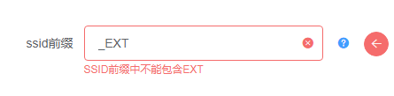

# 环境安装 

为了统一OEM开发环境，您需要安装整个CI服务器来进行OEM的本地开发。   

# 安装CI服务器 
请参考[环境安装 ](./环境安装.md)文档    

# OEM自动化开发原理  
通过预先在代码中打上标记，然后指定替换的规则。可以将服务器上用户输入的值替换掉原有标记的值。   
例如:  
在reasy-ui.css中要修改主菜单栏的颜色。在对应的样式下打上tag
```css
.menu{
/*main-color*/
background-color:#ed7020; 
/*main-color*/
}
```
配置规则：
```js
rules:[{
    tag:"main-color",
    where:["./reasy-ui.css"],
    how:function(match,userInput){
        return match.replace(/background-color:(.*?);/,`background-color:${userInput}`);
    }
}]
```
当用户上传颜色时，这个背景颜色就会被替换成对应的颜色。


## OEM本地调试  
OEM正常的流程回去SVN服务器上取出对应项目的代码。  
然而在开发OEM项目时，会进行大量的修改。如果频繁去SVN上取代码，会加大服务器压力。调试也不方便。  
所以需要特殊设置来进行本地调试。

### 打开调试标志位   
进入server>http_server>server.js文件中  
将global.debug.oemProduct设置为true。  
将这个标志位设置为true后，所有的操作都会在本地操作。  

### 拷贝项目文件
开启服务器后。拷贝一份项目源文件，复制到项目根目录>OEM_storage目录下。并将项目文件夹名称修改为A18-OEM（尽管你的项目不是A18）。  
现在，你的代码结构应当同下图一样：
A18-OEM文件夹中是你的项目代码。  


# OEM规则  
在A18-OEM文件夹下创建oem.config.js文件。  
oem.config.js是服务器读取规则的入口。  
遵循Node语法，可以在内部引用node自带函数，可以应用其他文件。    

## oem.config.js  
该文件暴露出一个数组  

```js  
module.exports = [tab1,tab2];  
```

数组内的每一个对象对应界面上的一个tab  

例如：
>设置  
tab1.title = "title修改"  
tab2.title = "链接修改"   

呈现的效果如下图所示


## tabs属性  
tabs下必须配置两个属性
1.title
2.pageRules  

| prop          | type   | detail                                    |
| :------------ | :----- | :---------------------------------------- |
| tab.title     | String | tab的标题                                 |
| tab.pageRules | Array  | 点击tab标签后，显示的详细配置项及替换规则 |
 

## pageRules
pageRules是一个数组,包含多个pageRule。  
```js
pageRules:[pageRule1,pageRule2]  
``` 
每个pageRule对应**一条**OEM定制配置  

pageRule属性  

| prop                | type     | detail                                                                         |
| :------------------ | :------- | :----------------------------------------------------------------------------- |
| pageRule.webOptions | Object   | 必填，配置项具体配置 [详细说明](./webOptions.md)                               |
| pageRule.rules      | Array    | 必填，详细的替换规则 [详细说明](#pageRule.rules)                               |
| pageRule.validator  | Function | 选填，用户输入后，如果配置了该项，则会进行校验 [详细说明](#pageRule.validator) |

## pageRule属性详解  

### pageRule.webOptions
因为webOptions的配置项较多，单独列出一个文档。    
详情请看这里[webOptions配置项](./webOptions.md) 

### pageRule.rules   
因为rules的配置比较复杂，也单独列出一个文档。    
详情请看这里[rules配置项](./rules.md) 

### pageRule.validator  

>该配置项用于校验用户输入是否合法  
>当用户输入一个值，并且blur或change或提交时，会发送数据给后台，后台会调用该函数校验。 

>validator接受一个参数，即**用户输入的值**。  
如果用户输入的值不满足要求，则返回对应的错误信息。  
如果满足所有校验，则不返回值。

```js
validator(input){
    if(/_EXT/.test(input)){
        return "SSID前缀中不能包含EXT";
    }
}
```

错误校验信息如下图所示：   
 
