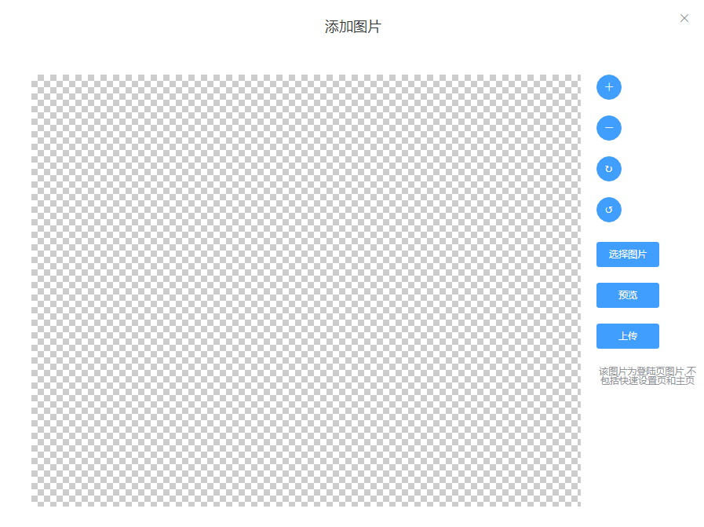

# webOptions
webOptions位于pageRule配置下，用于配置页面如何显示  
由于配置项较多，单独列出一个文档  

## pageRule.webOptions  

>该配置项用于设置配置项在WEB界面的展示

| prop                    | type                                     | detail                                                        |
| :---------------------- | :--------------------------------------- | :------------------------------------------------------------ |
| webOptions.type         | "input","select","colorPicker","img"之一 | 必填，配置项的展示方式  [详细说明](#type)                     |
| webOptions.title        | String                                   | 必填，配置项左边的标题(label)  [详细说明](#title)             |
| webOptions.detail       | String                                   | 必填，悬浮至配置项右边?后，显示的详细说明 [详细说明](#detail) |
| webOptions.defaultValue | String\|Array                            | 必填，修改项的默认值 [详细说明](#defaultValue)                |

**除了这四项必填之外，根据type的不同还需要配置其余选项**
**type:**
**input**(输入框) [查看input选项](#input)
**select**(下拉框) [查看select选项](#select)
**colorPicker**(拾色器) [查看colorPicker选项](#colorPicker)
**img**(图片选择器) [查看img选项](#img)


## title

> 配置项的左边的标题

```js
webOptions:{
     //@type:String
    title:"登陆页标题"
}
```

如图: 
  

## detail

> 鼠标悬浮至问号上时，会在右侧出现提示信息。主要用于提示用户详细的内容。  

```js
webOptions:{
    //@type:String
    detail:"当使用电脑访问设备时，在登陆页浏览器头部标签显示的文字"
}
```
如图:  
 

## defaultValue

> 作用有两点:
> 1.当用户没有进行配置时，页面会显示一个默认值。    
> 2.当用户点击回复默认按钮时，表单的值会恢复至默认值    
> 当type为img时,不需要填写此值

**注意:**
当type为select并且配置multiple为true时，defaultValue应当为数组。  
其余情况为字符串

```js
webOptions:{
    //@type String or Array
    defaultValue:"Tenda"
}
```

# type
**根据type的不同需要配置其余选项**
**input**(输入框) [查看input选项](#input)
**select**(下拉框) [查看select选项](#select)
**colorPicker**(拾色器) [查看colorPicker选项](#colorPicker)
**img**(图片选择器) [查看img选项](#img)


## input

> 当webOptions.type === "input" 时可以配置下列选项  

| prop                   | type   | detail                    |
| :--------------------- | :----- | :------------------------ |
| webOptions.placeholder | String | 选填，输入框的placeholder |

e.g:
```js
webOptions:{
    type:"input",
    title:"登陆页标题",
    detail:"xxx",
    defaultValue:"xxx",
    placeholder:"这是一个placeholder"  //选填
}
```  

效果:
  


## select  

> 当webOptions.type === "select" 时可以配置下列选项  

| prop                   | type    | detail                              |
| :--------------------- | :------ | :---------------------------------- |
| webOptions.selectArray | Object  | 必填，下拉框选项                    |
| webOptions.multiple    | Boolean | 选填，下拉框是否为多选。默认：false |
| webOptions.placeholder | String  | 选填，下拉框的placeholder           |

**注意**
当webOptions.multiple设置为true时，webOptions.defaultValue应该为数组形式 
并且用户选择时会有顺序关系，例如先选第三个选项，再选第一个选项，则传过来的值为 ["value3","value1"]

e.g:
```js
webOptions:{
    type:"select",
    title:"按顺序选择需要的语言项",
    detail:"xxx",
    multiple:true,
    selectArray:{
        cn:"中文",
        en:"英文",
        ru:"俄文",
        tr:"土耳其语"
    },
    defaultValue:["en","cn","ru","tr"]
}
```  

效果:
  

当multiple为false时，defaultValue应当为字符串
```js
webOptions:{
    type:"select",
    title:"快速设置页标题",
    detail:"xxx",
    multiple:false,
    selectArray:{
        value1:"选项1",
        value2:"选项2",
        value3:"选项3"
    },
    defaultValue:"value1"
}
```  

效果：  
 

## colorPicker  

> 当webOptions.type === "colorPicker" 时可以配置下列选项  

| prop                  | type    | detail                                   |
| :-------------------- | :------ | :--------------------------------------- |
| webOptions.show-alpha | Boolean | 选填，是否显示alpha通道选项，默认：false |

**注意**
当webOptions.show-alpha设置为false时，接收到的值和defaultValue为Hex格式。如:#ed7020  
当webOptions.show-alpha设置为true时，接收到的值和defaultValue为RGBA格式。如:rgba(255,255,255,0.8)  

e.g:
```js
webOptions:{
    type: "colorPicker",
    title: "主题色",
    detail: "xxx",
    "show-alpha":false,
    defaultValue: "#ed7020"
}
```  

效果:  


e.g:
```js
webOptions:{
    type: "colorPicker",
    title: "主题色",
    detail: "xxx",
    "show-alpha":true,
    defaultValue: "rgba(255,0,0,0.8)"
}
```  

效果:  


## img  

> 当webOptions.type === "img" 时可以配置下列选项  

| prop                  | type                   | detail                                           |
| :-------------------- | :--------------------- | :----------------------------------------------- |
| webOptions.outputType | String(png,jpeg或webp) | 必填，图片输出格式                               |
| webOptions.fixedBox   | Boolean                | 必填，是否固定截图框                             |
| webOptions.width      | String                 | 必填，初始截图框宽度                             |
| webOptions.height     | String                 | 必填，初始截图框高度                             |
| webOptions.where      | String                 | 必填，需要替换的图片的相对路径                   |
| webOptions.limitSize  | Number                 | 选填,图片上传的最大大小，超过此大小会报错，单位B |
| webOptions.imgTip     | String                 | 选填,点击选择图片后，右下角的文字提示            |

## outputType 
只能填写 png jpeg webp  
一般与需要图片的格式相同   

该项决定Vue-cropper插件生成Blob图片文件时的编码格式。  
如果图片为png格式而outputType为jpeg，则可能出现背景颜色全黑的情况

**注意** 如果图片格式是.jpg请填写jpeg  

## fixedBox  
当fixedBox为true时，截图框大小不可变动。  
且宽度等于webOptions.width,高度等于webOptions.height。  
当fixedBox为false时，截图框大小可以有用户放大缩小，截出来的图片大小同最终截图框大小有关。  
推荐设为true

## width  
初始截图框宽度  

## height  
初始截图框高度  

## where  
指明需要替换的图片的相对路径(相对于oem.config.js文件)   

## limitSize
限制用户上传图片的大小  单位B
当用户上传文件此阈值，会提示不能超过此值。  
例如: 需要限制用户上传文件大小不超过2M   
则配置 ```limitSize:2*1024*1024```  

## imgTip  
点击选择文件后，会弹出一个Model框，右下角的文字提示即imgTip配置的文字

示例:  
```js
webOptions:{
    type: "img",
    title: "Tenda LOGO替换",
    detail: "主页Logo，快速设置页Logo",
    fixedBox: true, //是否固定截图框,不固定的话用户可以截取任意大小的图片
    outputType: "png", //截图输出格式   png  jpeg webp
    width: "133", //图片输出宽度   可以带px也可以不带px
    height: "30", //图片输出高度
    where: "./img/logo.png",
    imgTip:"该图片为登陆页图片,不包括快速设置页和主页"
}
```

效果: 
;  

;  


