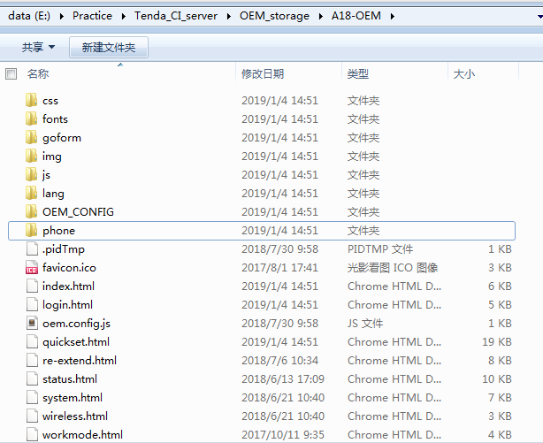
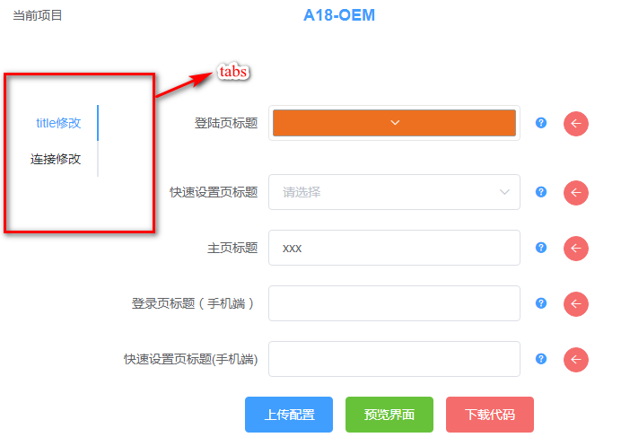
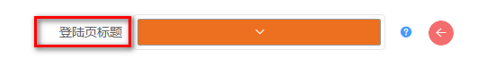
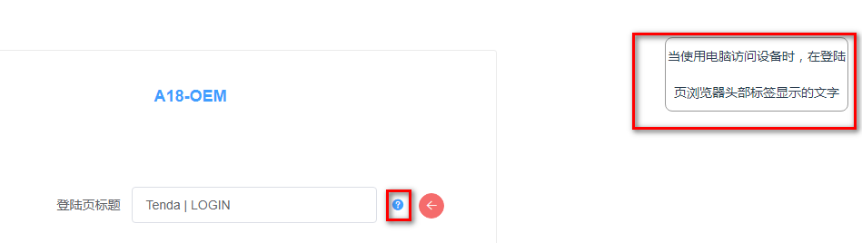
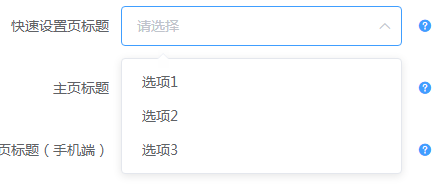

# 环境安装 

为了统一OEM开发环境，您需要安装整个CI服务器来进行OEM的本地开发。   

# 安装CI服务器 
请参考[环境安装 ](./环境安装.md)文档    

# OEM自动化开发原理  
通过预先在代码中打上标记，然后指定替换的规则。可以将服务器上用户输入的值替换掉原有标记的值。   
例如:  
在reasy-ui.css中要修改主菜单栏的颜色。在对应的样式下打上tag
```css
.menu{
/*main-color*/
background-color:#ed7020; 
/*main-color*/
}
```
配置规则：
```js
rules:[{
    tag:"main-color",
    where:["./reasy-ui.css"],
    how:function(match,userInput){
        return match.replace(/background-color:(.*?);/,`background-color:${userInput}`);
    }
}]
```
当用户上传颜色时，这个背景颜色就会被替换成对应的颜色。


## OEM本地调试  
OEM正常的流程回去SVN服务器上取出对应项目的代码。  
然而在开发OEM项目时，会进行大量的修改。如果频繁去SVN上取代码，会加大服务器压力。调试也不方便。  
所以需要特殊设置来进行本地调试。

### 打开调试标志位   
进入server>http_server>server.js文件中  
将global.debug.oemProduct设置为true。  
将这个标志位设置为true后，所有的操作都会在本地操作。  

### 拷贝项目文件
开启服务器后。拷贝一份项目源文件，复制到项目根目录>OEM_storage目录下。并将项目文件夹名称修改为A18-OEM（尽管你的项目不是A18）。  
现在，你的代码结构应当同下图一样：
A18-OEM文件夹中是你的项目代码。  



# OEM规则  
在A18-OEM文件夹下创建oem.config.js文件。  
oem.config.js是服务器读取规则的入口。  
遵循Node语法，可以在内部引用node自带函数，可以应用其他文件。    

## oem.config.js  
该文件暴露出一个数组  

```js  
module.exports = [tab1,tab2];  
```

数组内的每一个对象对应界面上的一个tab  

例如：
>设置  
tab1.title = "title修改"  
tab2.title = "链接修改"   

呈现的效果如下图所示


## tabs属性  
tabs下必须配置两个属性
1.title
2.pageRules  

| prop          | type   | detail                                    |
| :------------ | :----- | :---------------------------------------- |
| tab.title     | String | tab的标题                                 |
| tab.pageRules | Array  | 点击tab标签后，显示的详细配置项及替换规则 |
 

## pageRules
pageRules是一个数组,包含多个pageRule。  
```js
pageRules:[pageRule1,pageRule2]  
``` 
每个pageRule对应**一条**OEM定制配置  

pageRule属性  

| prop                       | type          | detail                                                                  |
| :------------------------- | :------------ | :---------------------------------------------------------------------- |
| pageRule.title             | String        | 配置项左边的标题(label)  [详细信息](#pageRule.title)                    |
| pageRule.detail            | String        | 悬浮至配置项右边?后，显示的详细信息 [详细信息](#pageRule.detail)        |
| pageRule.defaultValue      | String\|Array | 修改项的默认值[详细信息](#pageRule.defaultValue)                        |
| pageRule.webOptions        | Object        | 配置项具体配置[详细信息](#pageRule.webOptions)                          |
| (非必填)pageRule.validator | Function      | 用户输入后，如果配置了该项，则会进行校验[详细信息](#pageRule.validator) |
| pageRule.rules             | Array         | 详细的替换规则[详细信息](#pageRule.rules)                               |

## pageRule属性详解  

### pageRule.title
配置项左边的文字。
如下图  
  

### pageRule.detail  
悬浮至问号上时，会在右侧出现提示信息。  
这个提示信息即pageRule.detail中配置的信息  
如下图  
 

### pageRule.defaultValue  
当用户没有进行配置时，页面会显示一个默认值。  
这个默认值也是代码中没有替换时的初始值。  
当表单配置项为多选的下拉框时(select,并且配置multiple为true)  
defaultValue为一个数组  
表单配置项为输入框或者拾色器时，defaultValue为字符串。  

### pageRule.validator  
该配置项用于校验用户输入是否合法  
当用户输入一个值，并且blur时，会实时发送数据给后台，后台会调用该函数校验。 

validator接受一个参数，即用户输入的值。  
如果用户输入的值不满足要求，则返回对应的错误信息。  
如果满足所有校验，则不返回值。

```js
validator(input){
    if(error){
        return errorMessage;
    }
}
```

错误校验信息如下图所示：   
 


### pageRule.webOptions  
该配置项用于设置配置项的参数 

#### 公共配置  
必填：  
webOptions.type: **String**  
(可选值input、select、colorPicker) 默认为：input   
分别对应输入框，下拉框，拾色器  

选填：  
webOptions.placeholder: **String**  
当type为input或select时，里面的placeholder  

#### select特有配置  
webOptions.selectArray: **Object**  
下拉框的值
eg: 配置如下  
```js
selectArray:{
    "1": "选项1",
    "2": "选项2",
    "3": "选项3"
}
```
则页面显示如下：  
 


webOptions.multiple: **Bool** (**Optional**)  
当multiple为true时，下拉框变为多选下拉框。得到的用户输入也会变成数组。 且根据用户点击的顺序不同，得到的值也会不同。 例如先选选项2再选选项1。则在validator和how中得到的input为["2","1"]  

**注意**  
设置multiple为true时,defaultValue，validator，how等地方获取的值变成了数组。

#### colorPicker特有配置
webOptions."allow-alph": **Bool**  (**Optional**)  
当该项为true时，colorPicker中会出现透明度的选项。  
获取值与传值也会从基础的 #FFFFFF 变为 rgba(255,255,255,1)  

### pageRule.rules  
@type:Array   
pageRule.rules是包含一个或多个rule的**数组**。数组中的rule则指明如何去用用户输入去替换代码     

**注意事项**  
pageRule.rules中的所有rule都共用一个用户输入，请保证这些规则需要用到的输入是一致的  

每个rule都是一个对象,包含如下属性:  

rule.tag: **String**  [详细信息](#rule.tag)  
rule.where:**Array\<String\>**  [详细信息](#rule.where)  
rule.how:**Function**  [详细信息](#rule.how)  

以及查看更多[规则模板](./OEM规则模板.md)

#### rule.tag 
@type:String 指明用于标记的tag  

在html中标记用```<!--tagName-->```注释来做标记  
在css和js中用```/*tagName*/```做标记  

rule.tag不需要携带注释  
e.g：
你的标记为 ```<!--main-color-->```  rule.tag配置为```"main-color"```。 

**建议直接在需要修改的地方做标记，不要包含冗余的代码。**

正确示范: 
```css
.menu{
    color:#FFF;
    /*main-color*/
    background-color:#ed7020
    /*main-color*/
}
```
~~错误示范~~
```css
/*main-color*/
.menu{
    color:#FFF;
    background-color:#ed7020
}
/*main-color*/

.menu{   
    /*main-color*/
    color:#FFF;
    background-color:#ed7020
    /*main-color*/
}

```

#### rule.where  
@type:Array\<String\>

该配置项指明需要去哪些文件中替换。  
每个where配置项都是一个相对路径(相对于oem.config.js，也是相对于项目根目录)  
例：
项目目录结构如下
```
js
 |-xxx.js
 |-xxx.css
css
 |-reasy-ui.css
 |-login
 |   |-login.css
oem.config.js
``` 
js、css、oem.config.js同一层级  
如果要去替换reasy-ui.css和login.css中的某个tag。  
则配置rule.tag如下 
```js
rules:[{
    tag:"main-color",
    where:["./css/reasy-ui.css","./css/login/login.css]
}]
```
**注意事项**   
多个where直接共享how方法，请保证这些where文件中的替换规则是一致的。  

#### rule.how  
@type Function  
@params (match,userInput) 函数接收两个参数   
match 两个标记之间的内容  即上面例子中的background:xxx;  
userInput 用户输入的值   
@return 返回修改后的值  
e.g:
```js 
  return match.replace(/background-color:(.*?);/,`background-color:${userInput}`);
```

**注意事项**  
1.需要考虑用户多次上传配置的情况。  
例如：  
用户第一次修改背景色为#000,第二次又修改其为#FFF   

2.考虑用户输入乱码或者特殊的重复字段  
例如：  
用户输入 backgroud:xxx;  
第一次替换之后，会变成 backgroud:backgroud:xxx;  
此时代码就出错了。  
这种情况尽量在validator中去验证  

