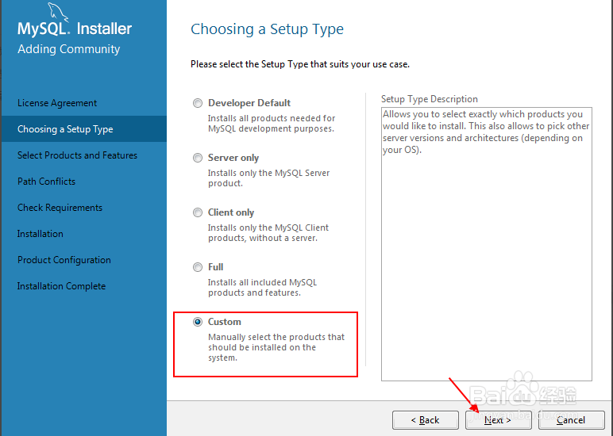
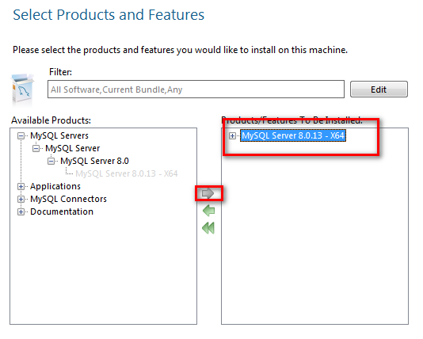
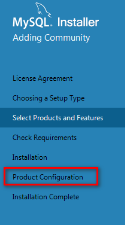
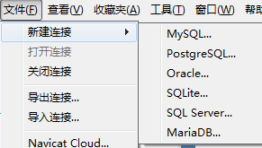
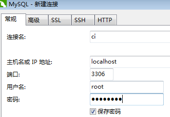
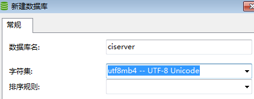

# 环境安装 
此文档用于指导安装完整CI服务器环境  

# 前置软件安装  
Mysql Server下载好之后，请暂时不要安装，其余软件先安装好。

1.Git Bash [下载链接](https://git-scm.com/downloads)   
2. Mysql Server  [下载链接](https://dev.mysql.com/downloads/windows/installer/)     选择Windows (x86, 32-bit), MSI Installer  300M左右的那个   
3. Navicat mysql  [下载链接](http://www.navicat.com.cn/products/navicat-for-mysql)  

## 安装Mysql Server  
安装好Git Bash 和 Navicat Mysql后。再进行Mysql Server的安装。  

打开Mysql Server连接下载好的mysql-installer-community-xxxx(版本号).msi 

### Step1 
1.Lisence AgreeMent 点同意后点击下一步。  
2.这时左边菜单栏应该为Choose A Setup Type。
选择**Custom**。点击下一步。

### Step2  
1.进入Select Product and Features界面  
2.仅选择Mysql Servers，并点击向右箭头。使其加入右边。  
3.最终效果如下。  右边只有Mysql Server。  
4.点击下一步

### Step3 
一直点击下一步，所有选择默认。  
如果有需要安装前置依赖，请自行下载安装(Microsoft VS 2015等)      
直到菜单Product Configuration   
这一步需要填入Mysql密码，请填入Fireitup(F大写)   
  

### Step4  
点击下一步直到安装完成  

## 创建数据库
打开Navicat软件  

1. 点击文件->新建链接->Mysql  
  

2. 填入连接名 ci  密码 Fireitup  然后点击创建  
  

3. 下面会出现CI的连接 右键CI，选择新建数据库。    
数据库名填入ciserver(全小写)。字符集 选择UTF-8，排序规则为空即可。    
  

4.完成以上步骤后，数据库创建完成  

## 开启服务器  

首先你需要从Github上下载最新的CI代码  

1.选择你要下载的目录  
2.在该目录下鼠标右键，选择git bash  
3.输入指令 ,等待下载完成
> git clone https://github.com/Zhuyi731/Tenda_CI_server 

4.输入指令 
> cd Tenda_CI_server 

5.输入指令  
> npm run start  

6.等待依赖自动安装完成，以及WEB目录自动编译，第一次安装持续时间可能较长   

7.以后的开启可以用npm run server开启服务器   

8.如果是要在服务器电脑上部署，请使用指令npm run start

